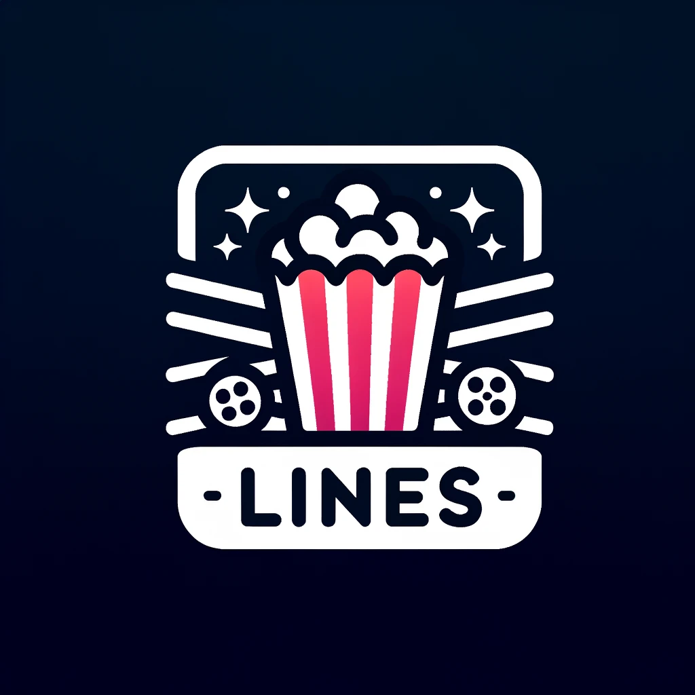

🎥 IMDB Clone 
 
  

Welcome to IMDB Clone, an immersive web application that brings the vast world of cinema right to your fingertips. Designed for movie buffs and casual viewers alike, this platform offers an engaging way to discover and delve into a plethora of popular films. 🍿

🌟 Features
Explore Movies: Navigate through a curated list of popular movies, showcasing their posters and titles.
In-depth Movie Details: Clicking on any movie reveals a detailed modal with insights such as the synopsis, average rating, release date, and video availability.
Seamless Experience: Designed to be responsive and user-friendly across all devices.

🛠️ Built Using
React - For crafting dynamic and interactive user interfaces
Styled Components - For streamlined and component-specific styling
Vite - A fast and modern frontend build tool
IMDb API - As the primary source for fetching movie information

🚀 Quick Start
Follow these steps to get the project up and running on your local machine:

Clone the repository:
git clone https://github.com/yourUsername/imdb-clone.git

Install the necessary dependencies:
npm install

Launch the application:
npm run dev
